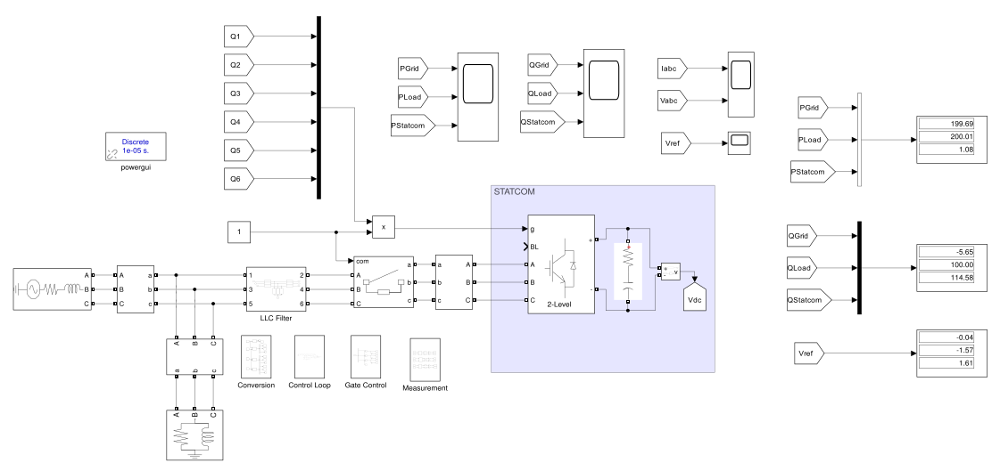
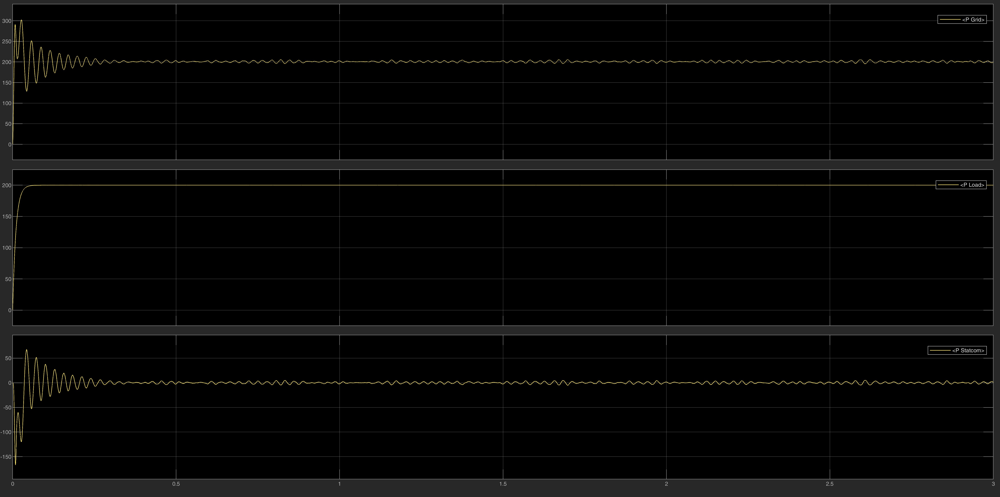
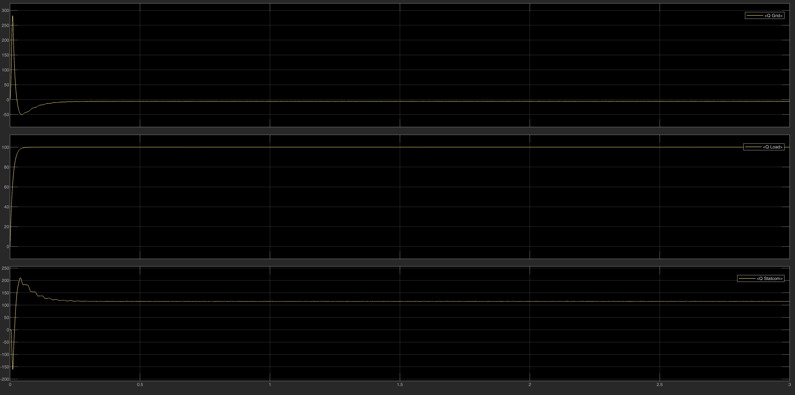

# Grid-Connected STATCOM System: dq0 Control

 

## 🚀 Overview
This repository contains the mathematical modeling, control design, and MATLAB/Simulink simulation of a grid-connected **Static Synchronous Compensator (STATCOM)**. The STATCOM utilizes a Two-Level Voltage Source Converter (VSC) to provide dynamic reactive power compensation for a local inductive load, thereby improving the grid's power factor to unity.

A robust Synchronous Reference Frame ($dq0$) control strategy is implemented alongside Sinusoidal Pulse Width Modulation (SPWM) to ensure precise, decoupled regulation of the DC-link voltage and reactive power.

## 🎯 Problem Statement (Project Requirements)
The primary objective is to design a STATCOM capable of fully compensating the reactive power demand of a local industrial load to relieve the main AC grid. 
*   **Grid Specifications:** $415\text{ V}$ (line-to-line RMS), $50\text{ Hz}$.
*   **Local Load:** $200\text{ kW}$ (Active Power) and $100\text{ kVAR}$ (Inductive Reactive Power).
*   **Target:** The STATCOM must dynamically inject $100\text{ kVAR}$ (capacitive) into the Point of Common Coupling (PCC) so that the grid supplies solely the active power ($Q_{Grid} \approx 0$).
*   **DC-Link Target:** Maintain a stable DC-link voltage of $800\text{ V}$ across a $10\text{ mF}$ capacitor.

## 🧠 Control Strategy
The system's performance is governed by the **Synchronous Reference Frame ($dq0$)** control theory, which transforms time-varying three-phase signals into DC quantities for zero steady-state error PI regulation.

1.  **Phase-Locked Loop (PLL):** Extracts the grid's phase angle ($\omega t$) for the $abc$-to-$dq0$ and $dq0$-to-$abc$ coordinate transformations.
2.  **Cascaded PI Loops:**
    *   **Outer Loop:** Regulates the DC-link voltage to $800\text{V}$, outputting the active current reference ($I_d^*$) to compensate for converter losses.
    *   **Inner Loops:** Regulate the $d$-axis and $q$-axis currents. The reactive current reference ($I_q^*$) is set to compensate the $100\text{ kVAR}$ load demand.
3.  **SPWM Generation:** The continuous $V_{ref}$ signals are compared against a $10\text{ kHz}$ triangular carrier wave to generate the IGBT gate pulses.

## ⚙️ System Performance Analysis
The simulation validates the STATCOM's exceptional transient and steady-state capabilities:

*   **Reactive Power Compensation:** Upon reaching steady-state (approx. $0.2\text{ s}$), the STATCOM successfully injects $100\text{ kVAR}$. The grid reactive power drops to zero, achieving a unity power factor.
*   **Voltage Regulation:** The outer PI loop rapidly charges and strictly maintains the DC-link voltage at $800\text{ V}$ with negligible ripple.
*   **Power Quality:** A third-order LCL filter ($300\,\mu\text{H}$, $500\,\mu\text{H}$, $100\,\mu\text{F}$) effectively attenuates the $10\text{ kHz}$ switching harmonics, ensuring highly sinusoidal grid currents that comply with power quality standards.

### 📊 Dynamic Response Highlight
| Active Power Flow ($P$) | Reactive Power Flow ($Q$) |
| :---: | :---: |
|  |  |

## 📂 Repository Structure
*   `Simulation/`: Contains the highly organized MATLAB/Simulink model (`.slx`) divided into modular subsystems (Control Loop, Conversion, Gate Control, LCL Filter, Measurement).
*   `Docs/`: Contains the final project report (`statcom-dq0-control.pdf`) detailing the theoretical background and comprehensive waveform analyses.
*   `Docs/LaTeX_Source/`: Contains the LaTeX source code and the `Images/` subfolder with all high-resolution vector diagrams and scope plots.

## 👨‍💻 Author
**Abd El-Rahman Muhammad Saad Muhammad**
*   **University:** Alexandria University
*   **Department:** Electrical Engineering
